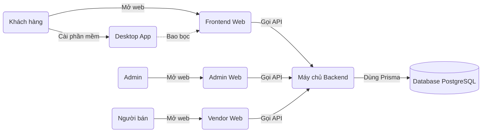

# MIVA

MIVA là một hệ thống thương mại điện tử (E-commerce) đa nền tảng hoàn chỉnh, nơi người bán có thể tạo gian hàng để bán sản phẩm, khách hàng có thể mua sắm, và ban quản trị có thể giám sát toàn bộ hoạt động.

Hệ thống phục vụ 3 nhóm người dùng chính:
- **Khách hàng (Customer)**: Người truy cập trang web để tìm kiếm, xem chi tiết và đặt mua sản phẩm.
- **Chủ cửa hàng (Vendor)**: Người bán hàng quản lý gian hàng của riêng mình, đăng sản phẩm mới và theo dõi các đơn đặt hàng.
- **Quản trị viên (Admin)**: Ban quản lý vận hành toàn bộ hệ thống, giám sát doanh thu và quản lý người dùng.

Để phục vụ 3 nhóm người dùng này, dự án được chia thành nhiều phần mềm (Application) riêng biệt cùng làm việc với nhau:
- **Frontend**: Trang web hiển thị dành riêng cho Khách hàng.
- **Admin**: Trang web hiển thị dành riêng cho Quản trị viên.
- **Vendor**: Trang web hiển thị dành riêng cho Chủ cửa hàng.
- **Desktop**: Phiên bản ứng dụng máy tính (giống như cài Zalo PC) của trang web Frontend dành cho khách hàng.
- **Backend**: Hệ thống máy chủ "chạy ngầm", hoàn toàn không có giao diện hiển thị. Nó đóng vai trò "bộ não" nhận lệnh từ Frontend/Admin/Vendor để xử lý tính toán.
- **Database (Cơ sở dữ liệu)**: Kho lưu trữ sổ sách ghi nhớ mọi thông tin (tên khách, giá sản phẩm, đơn hàng). Dự án sử dụng PostgreSQL.
- **Dataset**: Một công cụ tự động tạo ra "dữ liệu giả" (như tạo sẵn 1000 sản phẩm ảo) để các lập trình viên có thể kiểm tra hệ thống.

---

## Mục lục

1. [Hiểu kiến trúc MIVA trong 5 phút](#hiểu-kiến-trúc-miva-trong-5-phút)
2. [Sơ đồ tổng thể](#sơ-đồ-tổng-thể)
3. [Cây thư mục tổng quát](#cây-thư-mục-tổng-quát)
4. [Cấu trúc thư mục gốc](#cấu-trúc-thư-mục-gốc)
5. [Backend](#backend)
6. [NestJS cho người chưa biết](#nestjs-cho-người-chưa-biết)
7. [Giải thích Backend theo Module](#giải-thích-backend-theo-module)

---

## Hiểu kiến trúc MIVA trong 5 phút

Để dễ hình dung, hãy tưởng tượng MIVA là một **Nhà hàng**:

- **Frontend / Admin / Vendor (Giao diện hiển thị)**: Chính là **Quầy lễ tân & Bàn ăn**. Khách hàng chỉ nhìn thấy quyển menu đẹp mắt và bấm chọn món. Quầy lễ tân không tự nấu ăn, nó chỉ nhận yêu cầu.
- **Backend**: Chính là **Nhà bếp (Đội ngũ đầu bếp)**. Nơi đây ẩn phía sau, không ai nhìn thấy. Khi nhận được yêu cầu "Cho 1 đĩa cơm", đầu bếp sẽ tính toán công thức, kiểm tra xem còn gạo không, rồi mới nấu và bê ra.
- **Database (PostgreSQL)**: Là **Nhà kho nguyên liệu và Sổ kế toán**. Nơi lưu trữ gạo, thịt, và cuốn sổ ghi chép doanh thu.
- **API (Application Programming Interface)**: Là **Nhân viên bồi bàn**. Bồi bàn (API) là "cầu nối" chạy từ Quầy lễ tân (Frontend) mang tờ order xuống Nhà bếp (Backend), rồi lại bưng món ăn (Dữ liệu) từ Bếp lên cho Khách (Frontend).
- **Prisma**: Trong nhà bếp có rất nhiều đầu bếp (Backend) nói tiếng Việt, nhưng ông thủ kho (Database) lại chỉ hiểu tiếng Anh. **Prisma** là **Người phiên dịch** giúp Backend dễ dàng nói chuyện, lấy và cất dữ liệu vào Database mà không cần nói tiếng Anh (SQL).
- **Dataset**: Là **Đồ ăn nhựa trưng bày**. Khi nhà hàng mới xây xong chưa có đồ ăn thật, ta dùng đồ giả để bày lên bàn xem nhà hàng trông có đẹp không.

---

## Sơ đồ tổng thể



**Giải thích mũi tên:**
1. Khách hàng/Admin/Người bán tương tác trực tiếp bằng cách nhấp chuột trên trang web (`Frontend`, `Admin`, `Vendor`).
2. Bất kỳ lúc nào người dùng nhấp chuột (ví dụ: Đăng nhập), trang web sẽ "Gọi API" (giao việc cho bồi bàn) để gửi tài khoản/mật khẩu xuống `Backend`.
3. `Backend` nhận được, sẽ nhờ `Prisma` lục tìm trong `Database PostgreSQL` xem tài khoản đó có đúng không.
4. Kết quả đi ngược từ `Database` -> `Backend` -> `Frontend` để hiện thông báo "Đăng nhập thành công" cho người dùng.

---

## Cây thư mục tổng quát

Dưới đây là cây thư mục thực tế của dự án MIVA tại gốc thư mục:

```text
htttdn/
├── admin/         # Ứng dụng web dành cho Admin
├── backend/       # Máy chủ Backend / API xử lý trung tâm
├── dataset/       # Dữ liệu mẫu giả lập
├── desktop/       # Ứng dụng máy tính (bao bọc Frontend)
├── frontend/      # Website mua sắm cho Khách hàng
├── vendor/        # Ứng dụng web quản lý cho Chủ shop
│
├── package.json   # Cấu hình gốc của toàn bộ dự án
├── README.md      # Tài liệu bạn đang đọc
└── SURVEY_CRM_DOCS.md # Tài liệu riêng giải thích về hệ thống Khảo sát (Survey)
```

> **Lưu ý về `node_modules/`:** Trong bất kỳ thư mục nào ở trên, bạn cũng có thể thấy một thư mục tên là `node_modules/`. Đây là thư mục chứa "các công cụ tải từ trên mạng về" do người khác viết sẵn để hệ thống sử dụng (giống như hòm đồ nghề). Lập trình viên **không bao giờ** vào thư mục này để sửa code. Khi dự án lỗi thiếu thư viện, chỉ cần chạy lệnh `npm install` là máy tính sẽ tự động lên mạng tải lại hòm đồ nghề này.

---

## Cấu trúc thư mục gốc

Dưới đây là chức năng thực tế của từng thành phần nằm ở ngoài cùng (root):

| Thành phần | Loại | Chức năng |
|---|---|---|
| `admin/` | Application | Website quản trị hệ thống. Dành cho Admin duyệt người bán, xóa tài khoản, quản lý danh mục và xem thống kê toàn hệ thống. Được viết bằng React, Vite, Tailwind. |
| `frontend/` | Application | Website chính cho khách mua hàng. Hiển thị trang chủ, giỏ hàng, thông tin sản phẩm. Được viết bằng React, Vite. |
| `vendor/` | Application | Website cho tiểu thương. Quản lý sản phẩm của riêng shop mình, theo dõi đơn đặt hàng, xem doanh thu của shop. Cũng viết bằng React, Vite. |
| `desktop/` | Application | Dùng công nghệ Electron để bọc cái `frontend` thành một file `.exe`, cho phép khách hàng tải về cài vào máy tính (Windows/Mac) giống như một ứng dụng bình thường. |
| `backend/` | Application | Bộ não của toàn hệ thống, viết bằng **NestJS** (chạy trên Node.js). Toàn bộ 4 ứng dụng trên đều phải xin dữ liệu từ cái Backend này. |
| `dataset/` | Data Script | Chứa file `commerce_seed.sql` và `survey_seed.sql` cực lớn chứa hàng ngàn câu lệnh để "bơm" trực tiếp dữ liệu (hàng hóa, khảo sát) giả vào Database để test ngay lập tức. |
| `SURVEY_CRM_DOCS.md`| Documentation | Tài liệu kỹ thuật chuyên sâu chỉ nói về cấu trúc các bảng Khảo sát, cách vận hành hệ thống Survey. |

---

## Backend

Backend của hệ thống MIVA được xây dựng bằng công nghệ **NestJS** (một bộ khung xây dựng máy chủ cực kỳ chặt chẽ bằng ngôn ngữ TypeScript).

- **Backend dùng công nghệ gì?** NestJS, chạy trên môi trường Node.js. Nó dùng Prisma để nói chuyện với CSDL PostgreSQL.
- **Entry point (Điểm bắt đầu) nằm ở đâu?** File `backend/src/main.ts`. Khi ta gõ lệnh chạy máy chủ, máy tính sẽ đọc file này đầu tiên. File này sẽ mở một "bến cảng" mạng (thường là cổng 5000) và bắt đầu dỏng tai lắng nghe yêu cầu từ các Frontend gửi tới.
- **Application khởi động thế nào?** File `main.ts` sẽ gọi một "Quản lý tổng" tên là `AppModule` (`backend/src/app.module.ts`). Quản lý tổng này chứa sơ đồ của toàn bộ phòng ban (modules) trong hệ thống (như phòng Người Dùng, phòng Đơn Hàng).
- **Request (Yêu cầu) đi vào đâu?** Khi Frontend gửi một yêu cầu (Ví dụ: "Tạo sản phẩm mới"), yêu cầu đó đi vào bến cảng `main.ts`, sau đó đi vào một **Controller** tương ứng. Controller sẽ nhờ **Service** kiểm tra luật lệ, rồi Service gọi **Prisma** để lưu vào Database.

---

## NestJS cho người chưa biết

Nếu bạn là một lập trình viên Frontend, hoặc một người đang học việc nhìn vào Backend, đây là ý nghĩa thực sự của các file trong cấu trúc NestJS của MIVA:

- **Module (`.module.ts`)**: Giống như **phòng ban** của một công ty. Ví dụ `UserModule` là Phòng nhân sự, chuyên lo chuyện đăng nhập, tài khoản. Nó gom tất cả các nhân viên (Controller, Service) liên quan đến User vào chung một chỗ.
- **Controller (`.controller.ts`)**: Giống như **Nhân viên tiếp tân**. File này chuyên đứng nghe điện thoại từ Frontend gửi tới. Khi Frontend gọi API "Xóa sản phẩm số 1", Controller nhận điện thoại, nhưng nó không tự làm mà nhờ Service làm.
- **Service (`.service.ts`)**: Giống như **Chuyên viên nghiệp vụ (Người làm việc thật)**. Nó nhận lệnh từ Controller, sau đó suy nghĩ logic (Ví dụ: "Kiểm tra xem sản phẩm đó có thuộc về người bán này không?"), tính toán tiền bạc, rồi gọi Prisma lưu kết quả.
- **DTO (Data Transfer Object)**: Giống như **Biểu mẫu điền thông tin**. Trước khi Frontend gửi dữ liệu tạo sản phẩm lên, dữ liệu phải khớp với DTO. DTO quy định: "Tên sản phẩm phải là chữ, Giá tiền phải là số". Nếu Frontend gửi sai biểu mẫu, DTO sẽ lập tức chửi và chặn lại ngay từ cửa.
- **Guard (`.guard.ts`)**: Giống như **Bảo vệ gác cổng**. Trước khi yêu cầu được gặp Controller, nó phải đi qua Guard. Guard sẽ kiểm tra thẻ nhân viên (Token) xem bạn có phải là Admin không, nếu không phải Admin thì đuổi ra ngoài (Báo lỗi 403 Forbidden).
- **Decorator (`@...`)**: Là những cái nhãn dán bắt đầu bằng chữ `@`. Ví dụ dán `@Get()` lên một hàm nghĩa là dán nhãn "Hàm này chuyên nhận yêu cầu lấy dữ liệu". Dán `@Roles(UserRole.vendor)` nghĩa là dán cái bảng "Chỉ có Chủ shop mới được vào đây".
- **Dependency Injection (Tiêm phụ thuộc)**: Đây là một kỹ thuật lắp ghép. Controller không cần tự tạo ra Service. Nó chỉ cần nói "Tôi cần một anh chuyên viên ProductService", hệ thống NestJS sẽ tự động bắt một anh Service nhét (tiêm) vào cho Controller xài.

---

## Giải thích Backend theo Module

Dưới đây là cây thư mục THỰC TẾ các phòng ban xử lý nghiệp vụ của MIVA (`backend/src/app/`):

```text
backend/src/app/
├── auth/             # Xác thực (Đăng nhập, Đăng ký, Cấp thẻ Token)
├── users/            # Quản lý hồ sơ người dùng, phân quyền
├── products/         # Quản lý Sản phẩm
├── categories/       # Quản lý Danh mục hàng (Quần áo, Điện tử...)
├── product-colors/   # Quản lý màu sắc của từng sản phẩm
├── product-variants/ # Quản lý các biến thể kích cỡ (Size S, Size M)
├── orders/           # Tạo đơn đặt hàng, tính tổng tiền
├── payments/         # Xử lý thanh toán
├── cart/             # Quản lý Giỏ hàng của khách
├── reviews/          # Khách hàng đánh giá, chấm điểm sao
├── surveys/          # Hệ thống bài khảo sát ý kiến
├── vouchers/         # Mã giảm giá
├── notifications/    # Thông báo (Có đơn mới, Sản phẩm đang giao)
├── reports/          # Báo cáo thống kê, vẽ biểu đồ doanh thu
├── addresses/        # Sổ địa chỉ giao hàng của khách
├── realtime/         # Xử lý tương tác thời gian thực (ví dụ như WebSockets)
├── app.controller.ts # Tiếp tân phụ trách những yêu cầu chung chung (như xem giờ máy chủ)
└── app.module.ts     # Trụ sở chính quản lý tất cả các phòng ban trên
```

Khi Developer muốn sửa một tính năng, họ phải tìm đến đúng thư mục Module của tính năng đó. Dưới đây là phân tích chi tiết một module mẫu để hiểu cách dòng chảy dữ liệu diễn ra:

### Product Module (Xử lý Sản phẩm)

#### Mục đích
Là trung tâm tiếp nhận mọi hành động liên quan đến hàng hóa. Khách hàng xem danh sách hàng hóa, Chủ shop đăng bán mặt hàng mới, Admin khóa mặt hàng vi phạm, tất cả đều chạy qua phòng ban này.

#### Cấu trúc file thực tế
```text
products/
├── dto/
│   ├── create-product.dto.ts  # Biểu mẫu: Quy định khi tạo sản phẩm cần gửi Tên, Mô tả
│   ├── get-product.dto.ts     # Biểu mẫu: Quy định khi tìm kiếm thì cần gửi Trang số mấy
│   └── update-product.dto.ts  # Biểu mẫu: Quy định khi sửa sản phẩm
├── products.controller.ts     # Chỗ đứng chờ các yêu cầu API gửi tới
├── products.service.ts        # Não bộ xử lý các yêu cầu
└── products.module.ts         # Khai báo sự tồn tại của phòng ban này
```

#### Dữ liệu đi vào và đi ra như thế nào?

1. **Giao tiếp (Controller)**: Mở file `products.controller.ts`, bạn sẽ thấy các nhãn dán như `@Post() createProduct` có gắn bảng bảo vệ `@Roles(UserRole.vendor)`. Nghĩa là khi Chủ shop bấm "Lưu sản phẩm", dữ liệu (Tên áo, Giá) đi từ Web Chủ shop bay xuống trúng ngay chỗ này. Nó chặn không cho Khách hàng bình thường gọi vào.
2. **Xử lý (Service)**: Controller vứt dữ liệu cho file `products.service.ts`. Trong file này chứa các hàm thực tế như `createProduct()`. 
3. **Logic**: Service này sử dụng công cụ kiểm tra chữ (để biến tên "Áo Sơ Mi" thành đường dẫn "ao-so-mi"). Nó cũng kiểm tra xem cái áo đó đã tồn tại chưa (`existingProduct`). 
4. **Database**: Cuối cùng, Service gọi công cụ Prisma (`this.extended.create()`) để ghi dòng chữ "Áo Sơ Mi" vào sổ sách PostgreSQL thật sự.
5. **Đi ra**: Sổ sách ghi xong, Service báo OK, Controller lấy chữ OK đó bưng ngược lên (Response) cho trang web Chủ shop. Web nhận được sẽ hiện chữ màu xanh lá: "Đã thêm sản phẩm thành công!".
