# Sequence diagram toàn bộ backend

Tài liệu này phản ánh cấu trúc và luồng đang chạy trong `src/app`, `src/common`, `src/logger` và `src/catch-everything`.

Quy ước:

- Các API được bảo vệ đều đi qua pipeline chung ở mục 2.
- Các API có `@SkipAuth()` bỏ qua xác thực và phân quyền nhưng vẫn đi qua middleware, pipe, interceptor và filter.
- `PrismaBaseService` chỉ là lớp cha cung cấp model client, không phải một service nghiệp vụ độc lập.
- `CartItem`, `OrderDetail` và `VoucherDetail` được quản lý bên trong service cha, không có controller/service độc lập.
- Hệ thống hiện tại không có `Wishlist` và `StockMovement`.

## 1. Khởi động ứng dụng

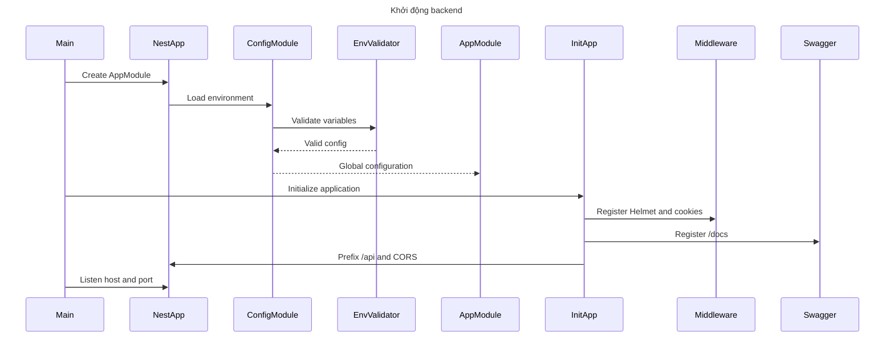

## 2. Pipeline dùng chung cho API được bảo vệ

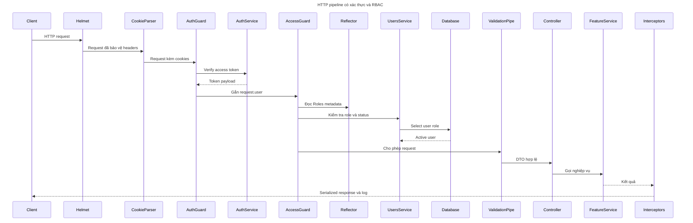

`@User()` hoặc `@CurrentUser()` lấy dữ liệu đã được `AuthGuard` đặt trong `request.user`. `@Roles()` chỉ lưu metadata để `AccessControlGuard` đọc bằng `Reflector`.

## 3. Pipeline dùng chung cho API công khai

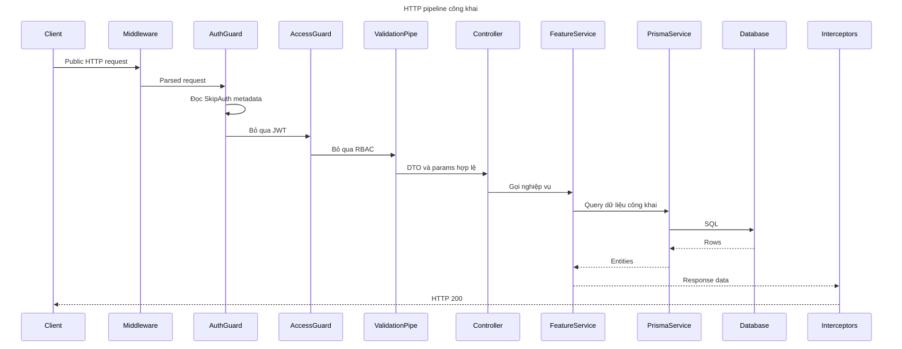

## 4. Xử lý lỗi dùng chung

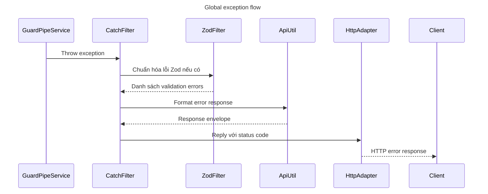

## 5. Common service và utility trong API danh sách

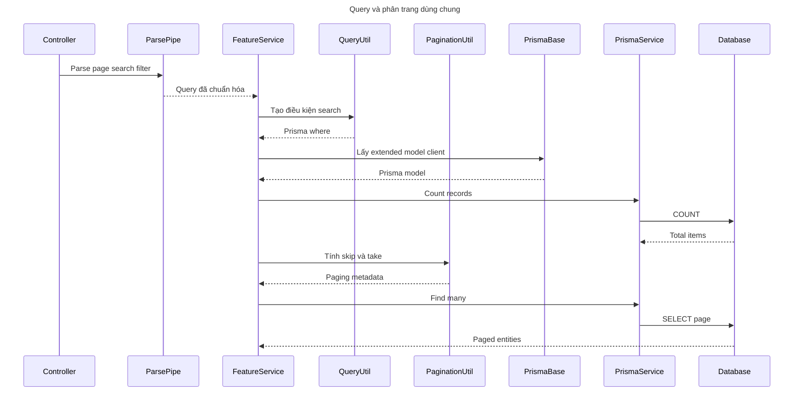

## 6. Đăng ký customer hoặc vendor

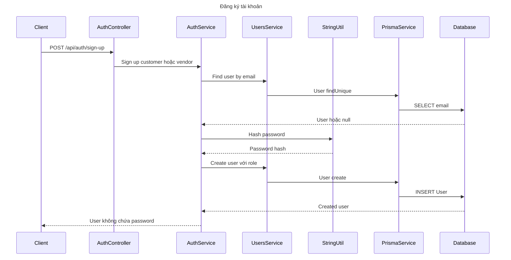

Endpoint customer là `/api/auth/sign-up`; endpoint vendor là `/api/auth/sign-up/vendor`.

## 7. Đăng nhập và tạo cookies

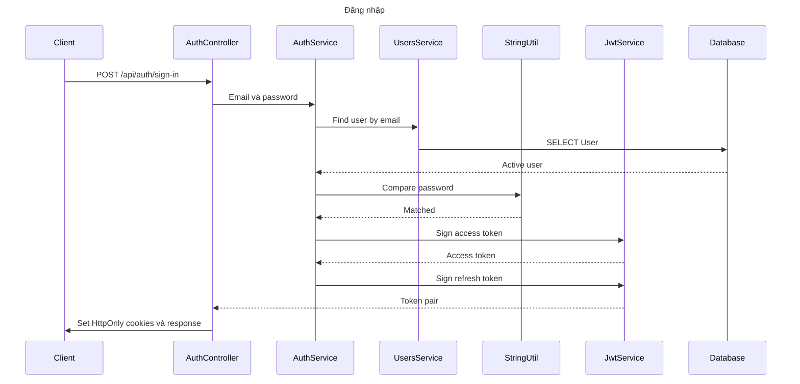

## 8. Làm mới token

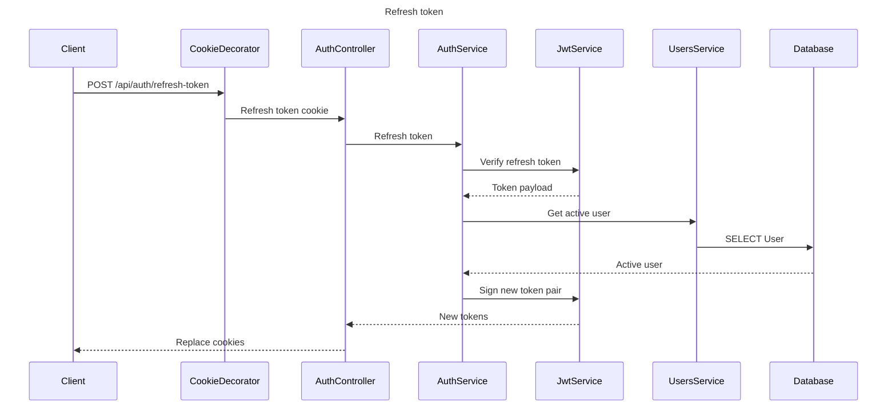

## 9. Đăng xuất

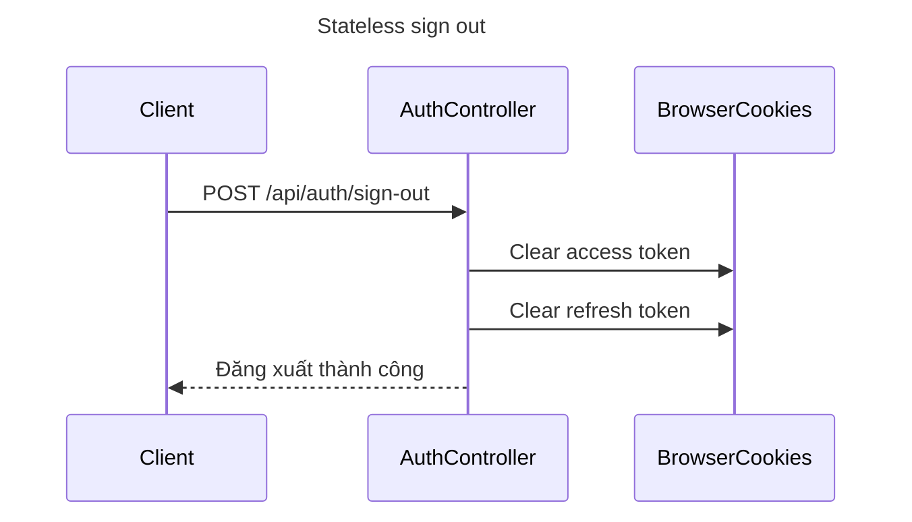

Đây là đăng xuất stateless. Token bị lộ vẫn hợp lệ đến khi hết hạn vì backend chưa có blacklist.

## 10. Users và profile

```mermaid
sequenceDiagram
    title Admin quản lý users và người dùng quản lý profile
    participant Actor
    participant UsersController
    participant ParsePipe
    participant UsersService
    participant QueryUtil
    participant PaginationUtil
    participant PrismaService
    participant Database

    Actor->>UsersController: GET users hoặc profile
    UsersController->>ParsePipe: Parse query nếu có
    ParsePipe-->>UsersController: Query hợp lệ
    UsersController->>UsersService: List get update hoặc disable
    UsersService->>QueryUtil: Build search và select
    QueryUtil-->>UsersService: Prisma options
    UsersService->>PaginationUtil: Build paging nếu list
    PaginationUtil-->>UsersService: Skip take metadata
    UsersService->>PrismaService: Execute operation
    PrismaService->>Database: SELECT hoặc UPDATE User
    Database-->>UsersService: User data
    UsersService-->>Actor: Response không có password
```

Admin dùng `GET /api/users`, `GET /api/users/options`, `GET/PATCH/DELETE /api/users/:id`. Người đã đăng nhập dùng `GET/PATCH /api/users/profile`.

## 11. Category công khai và admin quản lý

```mermaid
sequenceDiagram
    title Category flow
    participant Actor
    participant CategoryController
    participant CategoryService
    participant QueryUtil
    participant PaginationUtil
    participant StringUtil
    participant PrismaBase
    participant Database

    Actor->>CategoryController: GET POST PATCH hoặc DELETE
    CategoryController->>CategoryService: Category operation
    CategoryService->>QueryUtil: Build search khi GET
    CategoryService->>PaginationUtil: Build paging khi GET
    CategoryService->>StringUtil: Tạo slug khi POST
    CategoryService->>PrismaBase: Lấy Category model
    PrismaBase->>Database: SELECT INSERT UPDATE
    Database-->>CategoryService: Category data
    CategoryService-->>Actor: Response
```

`GET /api/categories` là công khai. POST, PATCH và DELETE chỉ dành cho admin; DELETE dùng soft delete.

## 12. Catalog sản phẩm công khai

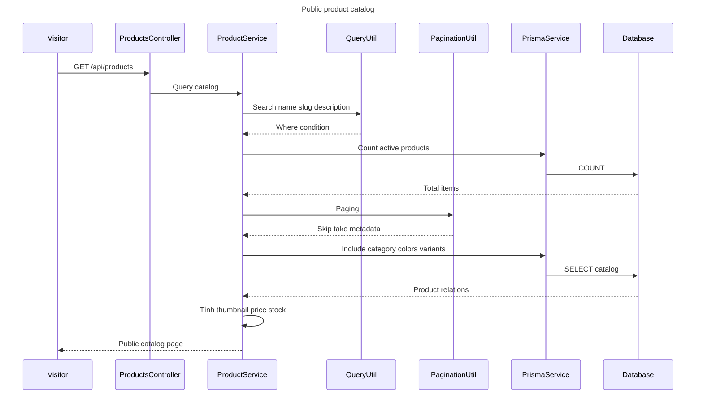

Các endpoint công khai gồm `GET /api/products`, `GET /api/products/category/:categorySlug` và `GET /api/products/:id`.

## 13. Vendor quản lý sản phẩm

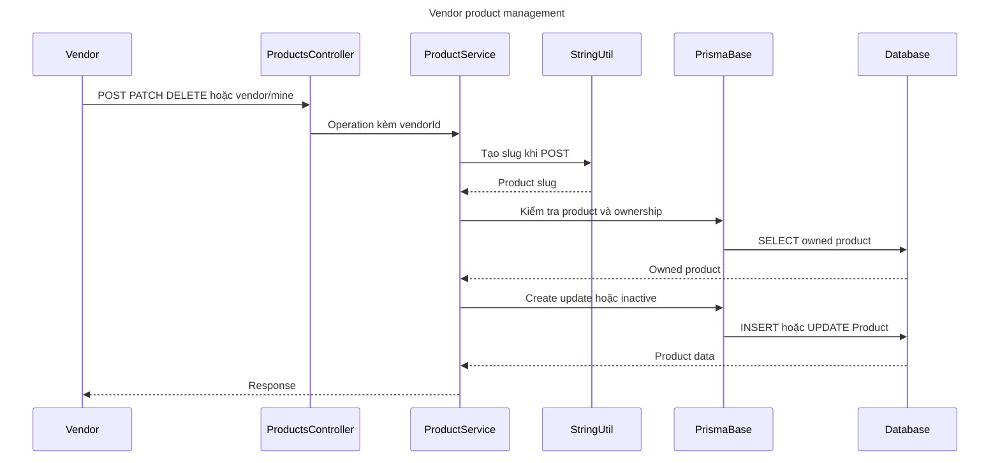

DELETE sản phẩm hiện chuyển `status` thành `inactive`, không xóa bản ghi.

## 14. ProductColor và upload ảnh

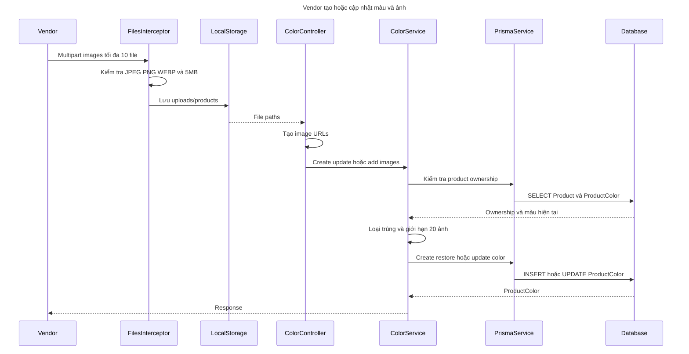

Nếu service thất bại sau khi upload, controller xóa các file vừa lưu. `DELETE /api/productColors/:id` chỉ đặt `deletedAt`; `PATCH /api/productColors/:id/restore` khôi phục lại màu và ảnh cũ.

## 15. ProductVariant

```mermaid
sequenceDiagram
    title Product variant flow
    participant Actor
    participant VariantController
    participant VariantService
    participant PrismaBase
    participant PrismaService
    participant Database

    Actor->>VariantController: GET POST PATCH hoặc DELETE
    VariantController->>VariantService: Variant operation
    VariantService->>PrismaService: Kiểm tra color và vendor ownership
    PrismaService->>Database: SELECT ProductColor và Product
    Database-->>VariantService: Active color
    VariantService->>PrismaBase: Kiểm tra size trùng
    PrismaBase->>Database: SELECT ProductVariant
    Database-->>VariantService: Duplicate hoặc null
    VariantService->>PrismaBase: Create update hoặc soft delete
    PrismaBase->>Database: INSERT hoặc UPDATE ProductVariant
    Database-->>VariantService: Variant data
    VariantService-->>Actor: Response
```

POST, PATCH và DELETE chỉ dành cho vendor. GET theo product color yêu cầu đăng nhập trong code hiện tại.

## 16. Vendor tạo voucher cho sản phẩm được chọn

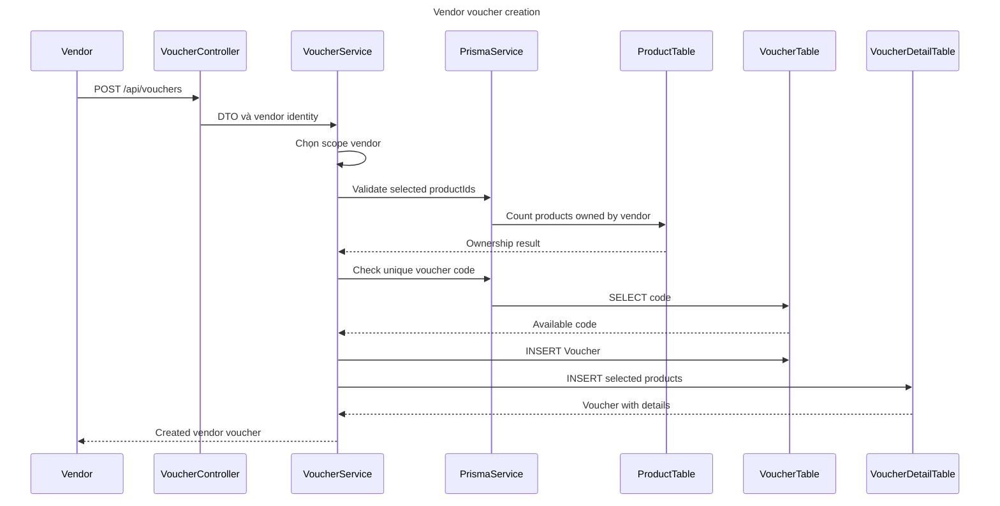

Vendor phải chọn ít nhất một sản phẩm và chỉ chọn sản phẩm của chính cửa hàng. Voucher không tự áp dụng cho toàn bộ sản phẩm hiện tại hoặc tương lai.

## 17. Admin tạo voucher toàn sàn

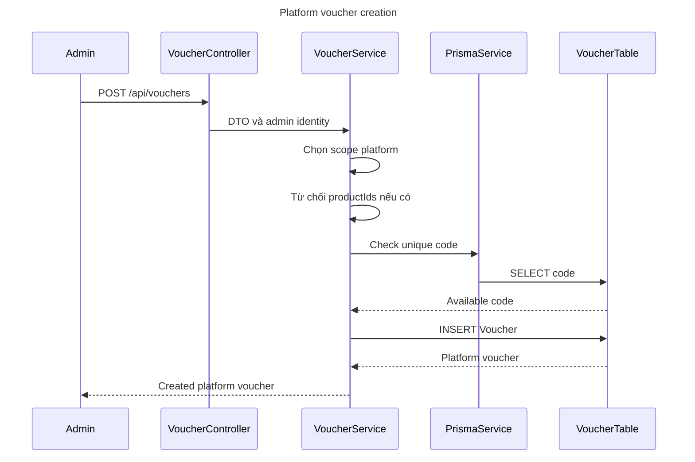

## 18. Quản lý voucher

```mermaid
sequenceDiagram
    title Voucher query update moderation and deletion
    participant Actor
    participant VoucherController
    participant VoucherService
    participant PrismaService
    participant Database

    Actor->>VoucherController: GET PATCH hoặc DELETE voucher
    VoucherController->>VoucherService: Operation kèm user identity
    VoucherService->>PrismaService: Find active voucher
    PrismaService->>Database: SELECT Voucher và details
    Database-->>VoucherService: Voucher data
    VoucherService->>VoucherService: Kiểm tra owner hoặc admin
    VoucherService->>PrismaService: Update details status hoặc deletedAt
    PrismaService->>Database: Transaction UPDATE
    Database-->>VoucherService: Updated voucher
    VoucherService-->>Actor: Response
```

Admin xem được tất cả voucher và có thể đổi trạng thái voucher vendor. Admin không sửa nội dung hoặc xóa voucher do vendor sở hữu; chủ voucher mới được làm hai thao tác đó.

## 19. Preview một hoặc hai voucher

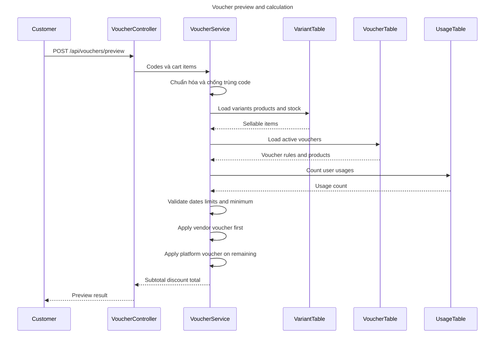

Tối đa một voucher vendor và một voucher platform trên một đơn. Voucher vendor chỉ tính trên sản phẩm đã chọn; voucher platform tính trên số tiền còn lại.

## 20. Cart và CartItem

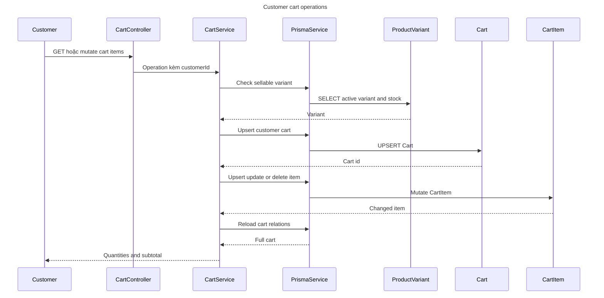

`CartItem` không có service riêng vì toàn bộ quyền sở hữu, tồn kho và tổng tiền được xử lý trong `CartService`.

## 21. Checkout giai đoạn kiểm tra

```mermaid
sequenceDiagram
    title Checkout validation phase
    participant Customer
    participant OrdersController
    participant OrdersService
    participant PrismaTransaction
    participant CartTable
    participant VoucherService
    participant ProductVariant
    participant VoucherTable

    Customer->>OrdersController: POST /api/orders/checkout
    OrdersController->>OrdersService: Receiver payment and vouchers
    OrdersService->>PrismaTransaction: Begin serializable transaction
    PrismaTransaction->>CartTable: Load CartItems
    CartTable-->>OrdersService: Customer cart
    OrdersService->>VoucherService: Calculate cart and voucher codes
    VoucherService->>ProductVariant: Validate products stock prices
    ProductVariant-->>VoucherService: Current variants
    VoucherService->>VoucherTable: Validate vouchers and usages
    VoucherTable-->>VoucherService: Applications
    VoucherService-->>OrdersService: Subtotal discount total items
```

## 22. Checkout giai đoạn ghi dữ liệu

```mermaid
sequenceDiagram
    title Checkout persistence phase
    participant OrdersService
    participant PrismaTransaction
    participant OrderTable
    participant VariantTable
    participant OrderDetailTable
    participant VoucherTable
    participant VoucherDetailTable
    participant PaymentTable
    participant HistoryTable
    participant CartItemTable

    OrdersService->>OrderTable: INSERT Order
    OrderTable-->>OrdersService: Order id and code
    OrdersService->>VariantTable: Atomic decrement stock
    VariantTable-->>OrdersService: Updated count
    OrdersService->>OrderDetailTable: INSERT snapshot details
    OrdersService->>VoucherTable: Atomic increment used quantity
    VoucherTable-->>OrdersService: Reserved voucher
    OrdersService->>VoucherDetailTable: INSERT order voucher usages
    OrdersService->>PaymentTable: INSERT pending payment
    OrdersService->>HistoryTable: INSERT pending history
    OrdersService->>CartItemTable: DELETE purchased cart items
    OrdersService->>PrismaTransaction: Commit
    PrismaTransaction-->>OrdersService: Order with relations
```

Nếu stock, voucher hoặc transaction bị xung đột, toàn bộ transaction rollback. Không có bảng `StockMovement`; stock được giảm trực tiếp trên `ProductVariant`.

## 23. Checkout phát realtime sau commit

```mermaid
sequenceDiagram
    title Order created realtime delivery
    participant OrdersService
    participant RealtimeService
    participant SocketServer
    participant CustomerRoom
    participant VendorRooms
    participant AdminRoom

    OrdersService->>RealtimeService: Emit order created
    RealtimeService->>SocketServer: Send to user room
    SocketServer-->>CustomerRoom: order:created
    RealtimeService->>SocketServer: Send to each vendor room
    SocketServer-->>VendorRooms: order:created
    RealtimeService->>SocketServer: Send to admins room
    SocketServer-->>AdminRoom: order:created
```

Event chỉ được phát sau khi transaction checkout đã commit thành công.

## 24. Truy vấn đơn hàng theo vai trò

```mermaid
sequenceDiagram
    title Order query authorization
    participant Actor
    participant OrdersController
    participant OrdersService
    participant PrismaService
    participant Database

    Actor->>OrdersController: GET order list hoặc detail
    OrdersController->>OrdersService: Query kèm identity
    OrdersService->>PrismaService: Load orders and relations
    PrismaService->>Database: SELECT Orders
    Database-->>OrdersService: Orders details payments vouchers history
    OrdersService->>OrdersService: Validate customer vendor or admin access
    OrdersService-->>Actor: Authorized order data
```

Customer xem đơn của mình, vendor xem đơn chứa sản phẩm của mình, admin xem toàn bộ.

## 25. Cập nhật trạng thái đơn hàng

```mermaid
sequenceDiagram
    title Normal order status update
    participant Actor
    participant OrdersController
    participant OrdersService
    participant PrismaTransaction
    participant PaymentTable
    participant OrderTable
    participant HistoryTable
    participant RealtimeService
    participant SocketRooms

    Actor->>OrdersController: PATCH /api/orders/:id/status
    OrdersController->>OrdersService: Target status and note
    OrdersService->>OrdersService: Check access and transition
    OrdersService->>PrismaTransaction: Begin transaction
    OrdersService->>PaymentTable: Mark COD paid when completed
    OrdersService->>OrderTable: UPDATE Order status
    OrdersService->>HistoryTable: INSERT status history
    OrdersService->>PrismaTransaction: Commit
    PrismaTransaction-->>OrdersService: Updated order
    OrdersService->>RealtimeService: Emit order updated
    RealtimeService-->>SocketRooms: order:updated
    OrdersService-->>Actor: Updated order
```

Chuỗi chuyển trạng thái hợp lệ là `pending → confirmed → processing → shipping → completed`. Customer chỉ được chuyển `pending → cancelled`. Vendor không được cập nhật đơn chứa sản phẩm từ nhiều cửa hàng.

## 26. Hủy đơn và hoàn tài nguyên

```mermaid
sequenceDiagram
    title Order cancellation
    participant Actor
    participant OrdersService
    participant PrismaTransaction
    participant VariantTable
    participant VoucherDetailTable
    participant VoucherTable
    participant PaymentTable
    participant OrderTable
    participant HistoryTable
    participant RealtimeService

    Actor->>OrdersService: Request cancelled status
    OrdersService->>OrdersService: Validate role and transition
    OrdersService->>PrismaTransaction: Begin transaction
    OrdersService->>VariantTable: Increment stock per OrderDetail
    OrdersService->>VoucherDetailTable: Set reversedAt
    OrdersService->>VoucherTable: Decrement used quantity
    OrdersService->>PaymentTable: Set cancelled or refunded
    OrdersService->>OrderTable: Set cancelled and cancelledAt
    OrdersService->>HistoryTable: Record cancellation
    OrdersService->>PrismaTransaction: Commit
    PrismaTransaction-->>OrdersService: Cancelled order
    OrdersService->>RealtimeService: Emit order updated
```

## 27. Payment query và admin cập nhật

```mermaid
sequenceDiagram
    title Payment flow
    participant Actor
    participant PaymentsController
    participant PaymentsService
    participant PrismaService
    participant Database
    participant RealtimeService
    participant SocketRooms

    Actor->>PaymentsController: GET payment hoặc PATCH status
    PaymentsController->>PaymentsService: Operation
    PaymentsService->>PrismaService: Load payment and order
    PrismaService->>Database: SELECT Payment relations
    Database-->>PaymentsService: Payment data
    PaymentsService->>PaymentsService: Check role and cancelled order
    PaymentsService->>PrismaService: UPDATE payment status
    PrismaService->>Database: UPDATE Payment timestamps
    Database-->>PaymentsService: Updated payment
    PaymentsService->>RealtimeService: Emit payment updated
    RealtimeService-->>SocketRooms: payment:updated
    PaymentsService-->>Actor: Payment response
```

Chỉ admin cập nhật trạng thái thanh toán. Customer, vendor liên quan và admin có thể xem payment của đơn. Backend hiện mới có xử lý nội bộ và COD, chưa có callback từ VNPay, Momo hoặc ZaloPay.

## 28. Review

```mermaid
sequenceDiagram
    title Review creation and moderation
    participant Actor
    participant ReviewsController
    participant ReviewsService
    participant OrderDetailTable
    participant ReviewTable
    participant Database

    Actor->>ReviewsController: GET POST PATCH hoặc DELETE review
    ReviewsController->>ReviewsService: Review operation
    ReviewsService->>OrderDetailTable: Verify completed purchase
    OrderDetailTable-->>ReviewsService: OrderDetail and existing review
    ReviewsService->>ReviewsService: Check owner duplicate and completion
    ReviewsService->>ReviewTable: Create update or soft delete
    ReviewTable->>Database: INSERT or UPDATE Review
    Database-->>ReviewsService: Review data
    ReviewsService-->>Actor: Response
```

Danh sách review theo sản phẩm là công khai. Customer chỉ đánh giá `OrderDetail` thuộc đơn đã hoàn thành và mỗi detail chỉ có một review. Admin có thể soft delete review.

## 29. Kết nối Socket.IO

```mermaid
sequenceDiagram
    title Realtime Socket.IO authentication
    participant Client
    participant RealtimeGateway
    participant AuthService
    participant UsersService
    participant Database
    participant SocketRooms

    Client->>RealtimeGateway: Connect namespace /realtime with token
    RealtimeGateway->>AuthService: Verify access token
    AuthService-->>RealtimeGateway: Token payload
    RealtimeGateway->>UsersService: Get user role and status
    UsersService->>Database: SELECT User
    Database-->>RealtimeGateway: Active user
    RealtimeGateway->>SocketRooms: Join user userId room
    RealtimeGateway->>SocketRooms: Join vendor userId when vendor
    RealtimeGateway->>SocketRooms: Join admins when admin
    RealtimeGateway-->>Client: realtime:ready
```

Token không hợp lệ, user inactive hoặc đã bị xóa sẽ bị ngắt kết nối ngay.

## 30. Phân phối sự kiện realtime

```mermaid
sequenceDiagram
    title Realtime event distribution
    participant DomainService
    participant RealtimeService
    participant SocketServer
    participant CustomerClients
    participant VendorClients
    participant AdminClients

    DomainService->>RealtimeService: Event and compact payload
    RealtimeService->>SocketServer: Emit to user room
    SocketServer-->>CustomerClients: order or payment event
    RealtimeService->>SocketServer: Emit to vendor rooms
    SocketServer-->>VendorClients: order or payment event
    RealtimeService->>SocketServer: Emit to admins room
    SocketServer-->>AdminClients: order or payment event
```

Các event hiện có:

- `realtime:ready`: xác nhận socket đã đăng nhập và join room.
- `order:created`: checkout thành công.
- `order:updated`: trạng thái đơn thay đổi, bao gồm hủy và hoàn thành.
- `payment:updated`: admin cập nhật payment qua Payment API.

Khi hoàn thành đơn COD, payment được đổi thành `paid` trong transaction cập nhật order nhưng backend chỉ phát `order:updated`; không phát thêm `payment:updated` ở nhánh này.

## 31. Health, Swagger và static product images

```mermaid
sequenceDiagram
    title Infrastructure endpoints
    participant Client
    participant NestApp
    participant AppController
    participant AppService
    participant PrismaService
    participant Swagger
    participant Uploads

    Client->>AppController: GET /api
    AppController->>AppService: Get hello message
    AppService-->>Client: Hello World
    Client->>AppController: GET /api/health
    AppController->>AppService: Check health
    AppService->>PrismaService: Query database
    PrismaService-->>AppService: Database status
    AppService-->>Client: Application and database health
    Client->>Swagger: GET /docs
    Swagger-->>Client: OpenAPI UI
    Client->>NestApp: GET /uploads/products/file
    NestApp->>Uploads: Read local image
    Uploads-->>Client: Static product image
```

## 32. Thành phần có source nhưng chưa tham gia runtime

Không đưa các thành phần sau vào participant của luồng đang chạy:

- `FormatResponseInterceptor`: có source nhưng chưa được đăng ký trong `AppModule` và chưa được dùng bằng `@UseInterceptors`.
- `ExcelResponseInterceptor`: có source nhưng chưa được đăng ký hoặc dùng ở controller.
- `common/query/options.interface.ts`: chỉ chứa TypeScript interface.
- Các file `const`: chỉ cung cấp hằng số hoặc ma trận quyền.
- `validate.env.ts`: chỉ chạy ở giai đoạn startup, đã được thể hiện tại mục 1.
- `DateUtilService`: đang được inject vào `PrismaService`, nhưng result extension sử dụng nó đang bị comment; interceptor Excel cũng chưa hoạt động.

## 33. Prisma extended client dùng chung

```mermaid
sequenceDiagram
    title Prisma extended query behavior
    participant FeatureService
    participant PrismaBase
    participant PrismaExtended
    participant StringUtil
    participant PrismaClient
    participant Database

    FeatureService->>PrismaBase: Truy cập extended model
    PrismaBase->>PrismaExtended: Resolve model client
    PrismaExtended->>PrismaExtended: Thêm deletedAt null khi đọc
    PrismaExtended->>PrismaExtended: Thêm default order khi findMany
    PrismaExtended->>StringUtil: Tạo slug khi create Product hoặc Category
    StringUtil-->>PrismaExtended: Normalized slug
    PrismaExtended->>PrismaExtended: Loại user và id khỏi create data
    PrismaExtended->>PrismaClient: Execute transformed query
    PrismaClient->>Database: SQL
    Database-->>PrismaClient: Rows
    PrismaClient-->>FeatureService: Result
```

`softDelete()` và `restore()` của extended model chuyển thành `UPDATE deletedAt`; chúng không tạo thêm bảng lịch sử.
