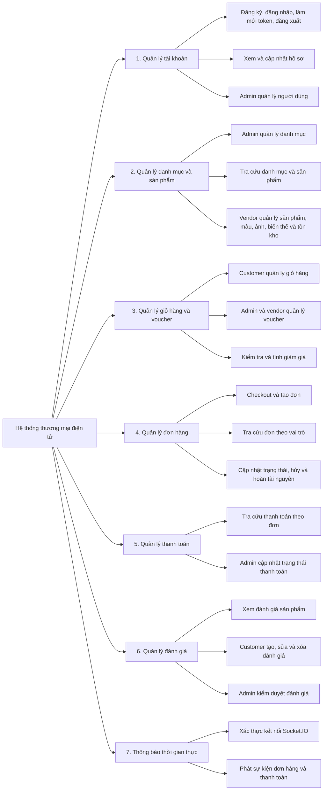
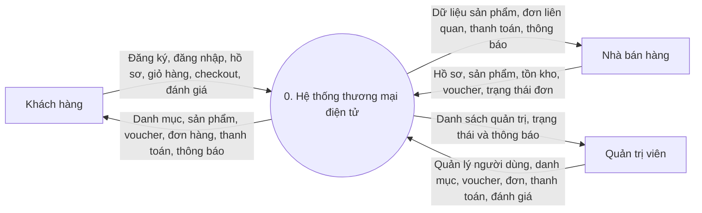
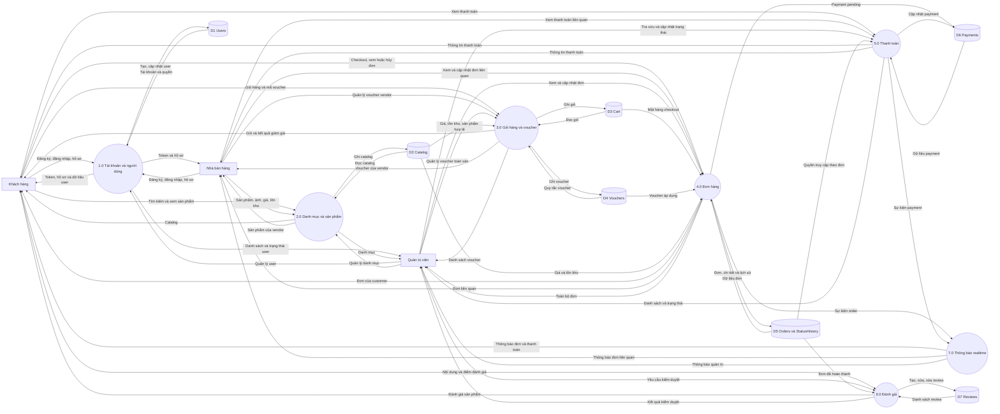
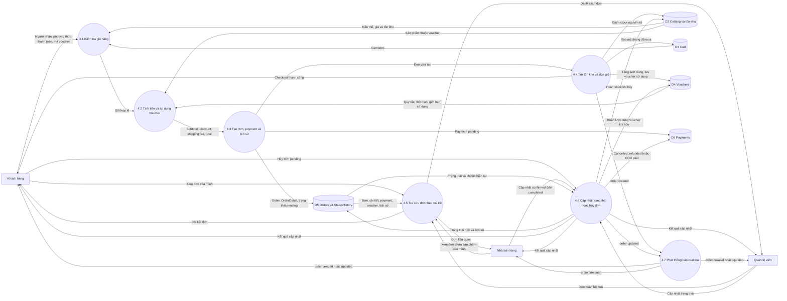

# BFD và DFD của hệ thống thương mại điện tử

Tài liệu được dựng từ các module đang được đăng ký trong `AppModule`, các controller/service đang chạy và `prisma/schema.prisma`.

Quy ước DFD:

- Hình chữ nhật: tác nhân ngoài.
- Hình tròn: tiến trình xử lý.
- Hình trụ: kho dữ liệu logic, tương ứng với các nhóm bảng Prisma.
- DFD bậc 2 phân rã tiến trình `4.0 Đơn hàng`, là tiến trình nghiệp vụ trung tâm và phức tạp nhất của backend hiện tại.

## 1. BFD - Biểu đồ phân rã chức năng

## 2. DFD bậc 0 - Sơ đồ ngữ cảnh

## 3. DFD bậc 1 - Các tiến trình chính

## 4. DFD bậc 2 - Phân rã tiến trình 4.0 Đơn hàng

## 5. Đối chiếu với source code

| Nhóm DFD | Module/bảng tương ứng |
|---|---|
| 1.0 Tài khoản và người dùng | `AuthModule`, `UserModule`, `User` |
| 2.0 Danh mục và sản phẩm | `CategoryModule`, `ProductsModule`, `ProductColorModule`, `ProductVariantModule`; `Category`, `Product`, `ProductColor`, `ProductVariant` |
| 3.0 Giỏ hàng và voucher | `CartModule`, `VouchersModule`; `Cart`, `CartItem`, `Voucher`, `VoucherDetail` |
| 4.0 Đơn hàng | `OrdersModule`; `Order`, `OrderDetail`, `OrderStatusHistory` |
| 5.0 Thanh toán | `PaymentsModule`; `Payment` |
| 6.0 Đánh giá | `ReviewsModule`; `Review` |
| 7.0 Thông báo realtime | `RealtimeModule`, Socket.IO; không có kho dữ liệu riêng |

Backend hiện chưa tích hợp callback trực tiếp từ VNPay, Momo hoặc ZaloPay, vì vậy cổng thanh toán ngoài không được đưa vào DFD.
