# BFD hệ thống thương mại điện tử

BFD (Business Function Diagram) dưới đây mô tả cây phân rã chức năng của hệ thống dựa trên các module và API đang có trong backend NestJS.

```mermaid
flowchart TB
    ecommerce["0. Hệ thống thương mại điện tử"]

    account["1. Quản lý tài khoản"]
    catalog["2. Quản lý danh mục và sản phẩm"]
    cartVoucher["3. Quản lý giỏ hàng và voucher"]
    order["4. Quản lý đơn hàng"]
    payment["5. Quản lý thanh toán"]
    review["6. Quản lý đánh giá"]
    realtime["7. Thông báo thời gian thực"]

    accountRegister["1.1 Đăng ký khách hàng và nhà bán hàng"]
    accountSession["1.2 Đăng nhập và quản lý phiên"]
    accountProfile["1.3 Xem và cập nhật hồ sơ"]
    accountAdmin["1.4 Quản trị người dùng"]

    catalogCategory["2.1 Tra cứu và quản lý danh mục"]
    catalogProduct["2.2 Tìm kiếm và xem sản phẩm"]
    catalogVendor["2.3 Quản lý sản phẩm của nhà bán hàng"]
    catalogColor["2.4 Quản lý màu sắc và hình ảnh"]
    catalogVariant["2.5 Quản lý kích cỡ, giá và tồn kho"]

    cartItems["3.1 Quản lý mặt hàng trong giỏ"]
    voucherManage["3.2 Quản lý voucher"]
    voucherAvailable["3.3 Tra cứu voucher khả dụng"]
    voucherPreview["3.4 Kiểm tra và tính giảm giá"]

    orderCheckout["4.1 Checkout và tạo đơn"]
    orderQuery["4.2 Tra cứu đơn theo vai trò"]
    orderDetail["4.3 Xem chi tiết đơn"]
    orderStatus["4.4 Cập nhật trạng thái hoặc hủy đơn"]
    orderResource["4.5 Đồng bộ tồn kho, giỏ và voucher"]
    orderHistory["4.6 Lưu lịch sử trạng thái"]

    paymentCreate["5.1 Khởi tạo thanh toán theo đơn"]
    paymentQuery["5.2 Tra cứu thanh toán"]
    paymentAdmin["5.3 Quản trị trạng thái thanh toán"]

    reviewPublic["6.1 Xem đánh giá sản phẩm"]
    reviewCustomer["6.2 Tạo, sửa và xóa đánh giá"]
    reviewAdmin["6.3 Kiểm duyệt đánh giá"]

    realtimeAuth["7.1 Xác thực kết nối Socket.IO"]
    realtimeChannel["7.2 Phân kênh theo người dùng và vai trò"]
    realtimeOrder["7.3 Phát sự kiện đơn hàng"]
    realtimePayment["7.4 Phát sự kiện thanh toán"]

    ecommerce --> account
    ecommerce --> catalog
    ecommerce --> cartVoucher
    ecommerce --> order
    ecommerce --> payment
    ecommerce --> review
    ecommerce --> realtime

    account --> accountRegister
    account --> accountSession
    account --> accountProfile
    account --> accountAdmin

    catalog --> catalogCategory
    catalog --> catalogProduct
    catalog --> catalogVendor
    catalog --> catalogColor
    catalog --> catalogVariant

    cartVoucher --> cartItems
    cartVoucher --> voucherManage
    cartVoucher --> voucherAvailable
    cartVoucher --> voucherPreview

    order --> orderCheckout
    order --> orderQuery
    order --> orderDetail
    order --> orderStatus
    order --> orderResource
    order --> orderHistory

    payment --> paymentCreate
    payment --> paymentQuery
    payment --> paymentAdmin

    review --> reviewPublic
    review --> reviewCustomer
    review --> reviewAdmin

    realtime --> realtimeAuth
    realtime --> realtimeChannel
    realtime --> realtimeOrder
    realtime --> realtimePayment

    classDef root fill:#C2E5FF,stroke:#3DADFF
    classDef functionGroup fill:#FFECBD,stroke:#FFC943
    classDef functionLeaf fill:#F5F5F5,stroke:#B3B3B3

    class ecommerce root
    class account,catalog,cartVoucher,order,payment,review,realtime functionGroup
    class accountRegister,accountSession,accountProfile,accountAdmin,catalogCategory,catalogProduct,catalogVendor,catalogColor,catalogVariant,cartItems,voucherManage,voucherAvailable,voucherPreview,orderCheckout,orderQuery,orderDetail,orderStatus,orderResource,orderHistory,paymentCreate,paymentQuery,paymentAdmin,reviewPublic,reviewCustomer,reviewAdmin,realtimeAuth,realtimeChannel,realtimeOrder,realtimePayment functionLeaf
```

## Cơ sở đối chiếu

- Tầng chức năng cấp 1 được lấy từ các module đăng ký trong `src/app/app.module.ts`.
- Các chức năng cấp 2 được đối chiếu với controller/service của từng module.
- Phân quyền thể hiện ba vai trò đang có trong Prisma: `customer`, `vendor`, `admin`.
- Thanh toán ngoài mới được biểu diễn ở mức quản lý trạng thái vì backend chưa có callback trực tiếp từ VNPay, Momo hoặc ZaloPay.
